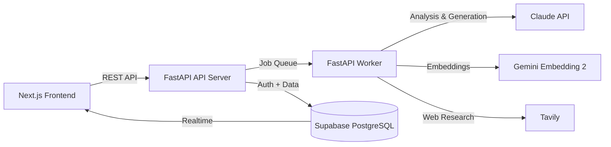

# XAIS Vault

> Document intelligence for knowledge professionals — researchers, lawyers, consultants, journalists, PMs, students, and PE/VC/M&A analysts.

> **Project status:** public educational snapshot for learning and experimentation. It is not a hosted service and is not actively maintained or supported. Run it locally with your own infrastructure and credentials.

[](https://github.com/ENNEADLABS/xais-vault/actions/workflows/ci.yml)


[](LICENSE)

---

## What it does

| Step | Action | Description |
|------|--------|-------------|
| 📄 | **Upload** | Drop your documents — PDF, DOCX, XLSX, PPTX, TXT |
| 🔍 | **Index** | Documents are extracted, chunked, and embedded for semantic search |
| 🤖 | **Analyze** | AI surfaces key insights, contradictions, missing info, and entity relationships |
| 💬 | **Chat** | Ask anything about your documents — answers come with cited source pages |
| 🔬 | **Investigate** | Dig deeper on any insight with a specialized research agent |
| 📊 | **Generate** | Export professional summaries, analysis memos, or full reports in DOCX |

---

## Tech Stack

| Layer | Technology |
|-------|------------|
| Frontend | Next.js 16, React 19, TypeScript 5, Base UI + shadcn/ui, Tailwind CSS v4 |
| Backend | FastAPI, Python 3.12, Pydantic v2 |
| Database | Supabase (PostgreSQL 17 + pgvector + Realtime) |
| AI — Analysis | Claude (Anthropic) |
| AI — Retrieval | Gemini Embedding 2 (Google) |
| AI — Research | Tavily Web Search |
| Local runtime | Docker Compose + Supabase CLI |

---

## Architecture



---

## Features

- **Document Intelligence** — PDF, DOCX, XLSX, PPTX, TXT extraction with page-level indexing
- **AI-Powered Analysis** — Automated insight extraction, key metric detection, missing info alerts
- **RAG Chat with Citations** — Semantic search answers with exact source page references
- **Knowledge Graph** — Interactive entity graph linking documents, people, organizations, and concepts
- **Configurable Personas** — Default generalist analyst, swappable to specialized profiles (DD analyst, etc.) per organization
- **Deep Investigation** — 4 specialized AI agents (Scanner, Verifier, Researcher, Writer)
- **Professional Deliverables** — One-click DOCX export (summary, analysis memo, full report)
- **Multi-tenant Organizations** — Role-based access control (admin, analyst, viewer)
- **Real-time Updates** — Supabase Realtime for live status changes across the UI
- **API Keys & Webhooks** — Public API with rate limiting, webhook subscriptions with HMAC signing
- **Billing & Plans** — Stripe-powered subscription plans with per-plan usage limits
- **MCP Server** — Model Context Protocol integration for AI-assisted document analysis
- **Super Admin Dashboard** — Cross-org operational dashboard (activity feed, health monitoring, platform KPIs)

---

## Quick Start

Prerequisites: Docker, the Supabase CLI, PostgreSQL client tools (`psql`), and API keys for Anthropic, Google, and Tavily.

```bash
git clone https://github.com/ENNEADLABS/xais-vault.git
cd xais-vault

supabase start
./scripts/bootstrap-database.sh

cp .env.example .env
# Copy the local keys printed by `supabase status` into .env,
# then add your Anthropic, Google, and Tavily keys.

docker compose up --build
```

Open the app at `http://localhost:3000`, the API docs at `http://localhost:8000/docs`, and Supabase Studio at `http://localhost:55323`.

For native development and troubleshooting, see [Getting Started](docs/getting-started.md).

---

## Project Structure

```
xais-vault/
├── apps/
│   ├── api/          # FastAPI server (auth, CRUD, SSE streaming)
│   ├── worker/       # Background jobs (AI agents, indexing, deliverables)
│   └── web/          # Next.js 16 frontend
├── packages/
│   ├── core/         # Shared config & agent schemas
│   ├── llm/          # LLM abstraction (Claude + Gemini)
│   ├── db/           # Supabase client & job queue
│   └── mcp-server/   # MCP Server (9 tools)
├── supabase/
│   ├── schema.sql    # Database schema (source of truth)
│   └── rls.sql       # Row-Level Security policies
├── tests/            # Backend test suite
└── docker-compose.yml
```

---

## API Endpoints

| Method | Endpoint | Description |
|--------|----------|-------------|
| GET | `/health` | Health check |
| GET | `/api/v2/profile` | Current user profile |
| GET | `/api/v2/organizations` | List organizations |
| GET/POST | `/api/v2/workspaces` | List / create workspaces |
| POST | `/api/v2/workspaces/{id}/sources` | Upload document |
| POST | `/api/v2/workspaces/{id}/chat` | Chat with workspace (SSE streaming) |
| GET | `/api/v2/workspaces/{id}/insights` | List insights |
| GET | `/api/v2/workspaces/{id}/investigations` | List investigation reports |
| POST | `/api/v2/workspaces/{id}/deliverables` | Generate DOCX deliverable |
| GET/POST | `/api/v2/workspaces/{id}/notes` | Workspace notes |
| POST | `/api/v2/api-keys` | Create API key |
| POST | `/api/v2/webhooks` | Create webhook subscription |
| GET | `/api/v2/super-admin/*` | Platform dashboard (super-admin only) |

Full interactive docs available at `/docs` in development mode.

---

## Tests

```bash
# Run backend tests with coverage report
pytest --cov=apps --cov=packages --cov-report=term-missing

# Lint
ruff check .

# Frontend type check (via build)
cd apps/web && npm run build
```

The snapshot includes extensive pytest and Vitest suites. CI enforces **60%** backend coverage and runs frontend lint, tests, build, and dependency audit.

---

## License

[MIT](LICENSE) © 2026 XAIS SOLUCES.
